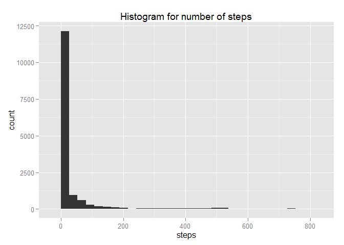

# Reproducible Research: Peer Assessment 1


## Loading and preprocessing the data

First lets read the data into a variable while specifying the class of each column:


```r
 data <- read.csv("activity.csv",colClasses=c("numeric","Date","numeric"))
```

## What is mean total number of steps taken per day?
In order to answer this question we use a data.table and ggplot2 for plotting a histogram.


```r
#lets first draw the histogram to get a feel for the data
library(ggplot2)
#then make the histogram
p1 <- qplot(steps,data=data,main="Histogram for number of steps")
p1
```

```
## stat_bin: binwidth defaulted to range/30. Use 'binwidth = x' to adjust this.
```

 

So it seems that there are quite a few intervals with 0 steps taken.
In order to complement this view, we look at a table showing mean and median for each day.


```r
#now on to the mean and median calculation. Load the data.table package
library(data.table)
```

```
## Warning: package 'data.table' was built under R version 3.1.3
```

```r
#then make a data table
dt <- data.table(data)

#then calculate the mean and median per day
meanMedian <- dt[,list(mean=mean(steps,na.rm=TRUE),median=median(steps, na.rm = TRUE)),by=date]
meanMedian
```

```
##           date       mean median
##  1: 2012-10-01        NaN     NA
##  2: 2012-10-02  0.4375000      0
##  3: 2012-10-03 39.4166667      0
##  4: 2012-10-04 42.0694444      0
##  5: 2012-10-05 46.1597222      0
##  6: 2012-10-06 53.5416667      0
##  7: 2012-10-07 38.2465278      0
##  8: 2012-10-08        NaN     NA
##  9: 2012-10-09 44.4826389      0
## 10: 2012-10-10 34.3750000      0
## 11: 2012-10-11 35.7777778      0
## 12: 2012-10-12 60.3541667      0
## 13: 2012-10-13 43.1458333      0
## 14: 2012-10-14 52.4236111      0
## 15: 2012-10-15 35.2048611      0
## 16: 2012-10-16 52.3750000      0
## 17: 2012-10-17 46.7083333      0
## 18: 2012-10-18 34.9166667      0
## 19: 2012-10-19 41.0729167      0
## 20: 2012-10-20 36.0937500      0
## 21: 2012-10-21 30.6284722      0
## 22: 2012-10-22 46.7361111      0
## 23: 2012-10-23 30.9652778      0
## 24: 2012-10-24 29.0104167      0
## 25: 2012-10-25  8.6527778      0
## 26: 2012-10-26 23.5347222      0
## 27: 2012-10-27 35.1354167      0
## 28: 2012-10-28 39.7847222      0
## 29: 2012-10-29 17.4236111      0
## 30: 2012-10-30 34.0937500      0
## 31: 2012-10-31 53.5208333      0
## 32: 2012-11-01        NaN     NA
## 33: 2012-11-02 36.8055556      0
## 34: 2012-11-03 36.7048611      0
## 35: 2012-11-04        NaN     NA
## 36: 2012-11-05 36.2465278      0
## 37: 2012-11-06 28.9375000      0
## 38: 2012-11-07 44.7326389      0
## 39: 2012-11-08 11.1770833      0
## 40: 2012-11-09        NaN     NA
## 41: 2012-11-10        NaN     NA
## 42: 2012-11-11 43.7777778      0
## 43: 2012-11-12 37.3784722      0
## 44: 2012-11-13 25.4722222      0
## 45: 2012-11-14        NaN     NA
## 46: 2012-11-15  0.1423611      0
## 47: 2012-11-16 18.8923611      0
## 48: 2012-11-17 49.7881944      0
## 49: 2012-11-18 52.4652778      0
## 50: 2012-11-19 30.6979167      0
## 51: 2012-11-20 15.5277778      0
## 52: 2012-11-21 44.3993056      0
## 53: 2012-11-22 70.9270833      0
## 54: 2012-11-23 73.5902778      0
## 55: 2012-11-24 50.2708333      0
## 56: 2012-11-25 41.0902778      0
## 57: 2012-11-26 38.7569444      0
## 58: 2012-11-27 47.3819444      0
## 59: 2012-11-28 35.3576389      0
## 60: 2012-11-29 24.4687500      0
## 61: 2012-11-30        NaN     NA
##           date       mean median
```


Indeed, the median is mostly 0 showing that there are many intervals with 0 steps taken per day.


## What is the average daily activity pattern?
Now we want to look closer at which intervals are active or not.
We fist make a time series plot (line chart) of the 5-minute intervals (x-axis) and the average number of steps taken during each interval, averaged across all days (y-axis)


```r
#get the mean steps per interval
meanIntervalSteps <- dt[,list(mean=mean(steps,na.rm=TRUE),median=median(steps, na.rm = TRUE)),by=interval]

#plot them
ggplot(meanIntervalSteps,aes(interval,mean))+geom_line(colour = "royalblue2", size = 1)
```

 


Now we'll try to calculate Which 5-minute interval, on average across all the days in the dataset, contains the maximum number of steps

```r
meanIntervalSteps$interval[which.max(meanIntervalSteps$mean)]
```

```
## [1] 835
```

So the answer is interval 835. If we assume that the interval value is probably the number of minutes since midnight, then this is maybe this hour of the day (roughly): 14:00. Maybe the subject takes a walk after lunch?


## Imputing missing values
In order to deal with NAs we'll do the following:

- Calculate and report the total number of missing values in the dataset (i.e. the total number of rows with NAs)


```r
#the number of NA values is:
length(which(is.na(data$steps)))
```

```
## [1] 2304
```
So the answer is: 2304 NA values

- Next we will replace NA values with the mean for that 5-minute interval over all days and create a new dataset that is equal to the original dataset but with the missing data filled in.


```r
modifiedData <- data

for(i in 1:nrow(modifiedData)){

    if(is.na(modifiedData$steps[i])){
       intval <- modifiedData[i,3]
       #get the average for this day
       avg <- meanIntervalSteps[interval == intval,]
       mean <- avg$mean
       
       #now fill the respective cell
       modifiedData[i,1] <- mean
    }
}
```


- Now we make a histogram of the total number of steps taken each day and Calculate and report the mean and median total number of steps taken per day. We want to see if these values differ from the estimates from the first part of the assignment. 


```r
library(gridExtra)
```

```
## Warning: package 'gridExtra' was built under R version 3.1.3
```

```
## Loading required package: grid
```

```r
#first show the new and old histogram side by side to check if we can see a difference
p2 <- qplot(steps,data=modifiedData,main="Histogram for number of steps with NAs replaced by mean per interval")
grid.arrange(p1, p2)
```

```
## stat_bin: binwidth defaulted to range/30. Use 'binwidth = x' to adjust this.
## stat_bin: binwidth defaulted to range/30. Use 'binwidth = x' to adjust this.
```

 

The histograms look fairly similar, but there are small difference (see y-axis and the interval around 600 on the x-axis).
Now we'll calculate the differences in mean and median, just to see what the data looks like. If the value is 0 nothing has changed.


```r
#make a data table like before
dt2 <- data.table(modifiedData)

#then calculate the mean and median per day
meanMedian2 <- dt2[,list(mean=mean(steps,na.rm=TRUE),median=median(steps, na.rm = TRUE)),by=date]

#check if the values differ from those in the first part of the assignment
differenceTable <- data.frame(meanMedian$mean,meanMedian2$mean,meanMedian$median,meanMedian2$median)
names(differenceTable) <- c("original_mean","new_mean","original_median","new_median")
differenceTable$meanDifference <- differenceTable$original_mean - differenceTable$new_mean
differenceTable$medianDifference <- differenceTable$original_median - differenceTable$new_median
differenceTable
```

```
##    original_mean   new_mean original_median new_median meanDifference
## 1            NaN 37.3825996              NA   34.11321            NaN
## 2      0.4375000  0.4375000               0    0.00000              0
## 3     39.4166667 39.4166667               0    0.00000              0
## 4     42.0694444 42.0694444               0    0.00000              0
## 5     46.1597222 46.1597222               0    0.00000              0
## 6     53.5416667 53.5416667               0    0.00000              0
## 7     38.2465278 38.2465278               0    0.00000              0
## 8            NaN 37.3825996              NA   34.11321            NaN
## 9     44.4826389 44.4826389               0    0.00000              0
## 10    34.3750000 34.3750000               0    0.00000              0
## 11    35.7777778 35.7777778               0    0.00000              0
## 12    60.3541667 60.3541667               0    0.00000              0
## 13    43.1458333 43.1458333               0    0.00000              0
## 14    52.4236111 52.4236111               0    0.00000              0
## 15    35.2048611 35.2048611               0    0.00000              0
## 16    52.3750000 52.3750000               0    0.00000              0
## 17    46.7083333 46.7083333               0    0.00000              0
## 18    34.9166667 34.9166667               0    0.00000              0
## 19    41.0729167 41.0729167               0    0.00000              0
## 20    36.0937500 36.0937500               0    0.00000              0
## 21    30.6284722 30.6284722               0    0.00000              0
## 22    46.7361111 46.7361111               0    0.00000              0
## 23    30.9652778 30.9652778               0    0.00000              0
## 24    29.0104167 29.0104167               0    0.00000              0
## 25     8.6527778  8.6527778               0    0.00000              0
## 26    23.5347222 23.5347222               0    0.00000              0
## 27    35.1354167 35.1354167               0    0.00000              0
## 28    39.7847222 39.7847222               0    0.00000              0
## 29    17.4236111 17.4236111               0    0.00000              0
## 30    34.0937500 34.0937500               0    0.00000              0
## 31    53.5208333 53.5208333               0    0.00000              0
## 32           NaN 37.3825996              NA   34.11321            NaN
## 33    36.8055556 36.8055556               0    0.00000              0
## 34    36.7048611 36.7048611               0    0.00000              0
## 35           NaN 37.3825996              NA   34.11321            NaN
## 36    36.2465278 36.2465278               0    0.00000              0
## 37    28.9375000 28.9375000               0    0.00000              0
## 38    44.7326389 44.7326389               0    0.00000              0
## 39    11.1770833 11.1770833               0    0.00000              0
## 40           NaN 37.3825996              NA   34.11321            NaN
## 41           NaN 37.3825996              NA   34.11321            NaN
## 42    43.7777778 43.7777778               0    0.00000              0
## 43    37.3784722 37.3784722               0    0.00000              0
## 44    25.4722222 25.4722222               0    0.00000              0
## 45           NaN 37.3825996              NA   34.11321            NaN
## 46     0.1423611  0.1423611               0    0.00000              0
## 47    18.8923611 18.8923611               0    0.00000              0
## 48    49.7881944 49.7881944               0    0.00000              0
## 49    52.4652778 52.4652778               0    0.00000              0
## 50    30.6979167 30.6979167               0    0.00000              0
## 51    15.5277778 15.5277778               0    0.00000              0
## 52    44.3993056 44.3993056               0    0.00000              0
## 53    70.9270833 70.9270833               0    0.00000              0
## 54    73.5902778 73.5902778               0    0.00000              0
## 55    50.2708333 50.2708333               0    0.00000              0
## 56    41.0902778 41.0902778               0    0.00000              0
## 57    38.7569444 38.7569444               0    0.00000              0
## 58    47.3819444 47.3819444               0    0.00000              0
## 59    35.3576389 35.3576389               0    0.00000              0
## 60    24.4687500 24.4687500               0    0.00000              0
## 61           NaN 37.3825996              NA   34.11321            NaN
##    medianDifference
## 1                NA
## 2                 0
## 3                 0
## 4                 0
## 5                 0
## 6                 0
## 7                 0
## 8                NA
## 9                 0
## 10                0
## 11                0
## 12                0
## 13                0
## 14                0
## 15                0
## 16                0
## 17                0
## 18                0
## 19                0
## 20                0
## 21                0
## 22                0
## 23                0
## 24                0
## 25                0
## 26                0
## 27                0
## 28                0
## 29                0
## 30                0
## 31                0
## 32               NA
## 33                0
## 34                0
## 35               NA
## 36                0
## 37                0
## 38                0
## 39                0
## 40               NA
## 41               NA
## 42                0
## 43                0
## 44                0
## 45               NA
## 46                0
## 47                0
## 48                0
## 49                0
## 50                0
## 51                0
## 52                0
## 53                0
## 54                0
## 55                0
## 56                0
## 57                0
## 58                0
## 59                0
## 60                0
## 61               NA
```


We can see that indeed there are a few differences in that mean and median exist for all days now.

- Now, lets answer: What is the impact of imputing missing data on the estimates of the total daily number of steps?

```r
#look at the total number of daily steps
#first in the original data
sumSteps <- dt[,list(stepCount=sum(steps,na.rm=TRUE)),by=date]
#now in the replaced data
sumSteps2 <- dt2[,list(stepCount=sum(steps,na.rm=TRUE)),by=date]

differenceTable <- data.frame(sumSteps$stepCount,sumSteps2$stepCount)
names(differenceTable) <- c("stepCountOriginal","stepCountNAReplaced")

differenceTable$Difference <- differenceTable$stepCountOriginal - differenceTable$stepCountNAReplaced
differenceTable
```

```
##    stepCountOriginal stepCountNAReplaced Difference
## 1                  0            10766.19  -10766.19
## 2                126              126.00       0.00
## 3              11352            11352.00       0.00
## 4              12116            12116.00       0.00
## 5              13294            13294.00       0.00
## 6              15420            15420.00       0.00
## 7              11015            11015.00       0.00
## 8                  0            10766.19  -10766.19
## 9              12811            12811.00       0.00
## 10              9900             9900.00       0.00
## 11             10304            10304.00       0.00
## 12             17382            17382.00       0.00
## 13             12426            12426.00       0.00
## 14             15098            15098.00       0.00
## 15             10139            10139.00       0.00
## 16             15084            15084.00       0.00
## 17             13452            13452.00       0.00
## 18             10056            10056.00       0.00
## 19             11829            11829.00       0.00
## 20             10395            10395.00       0.00
## 21              8821             8821.00       0.00
## 22             13460            13460.00       0.00
## 23              8918             8918.00       0.00
## 24              8355             8355.00       0.00
## 25              2492             2492.00       0.00
## 26              6778             6778.00       0.00
## 27             10119            10119.00       0.00
## 28             11458            11458.00       0.00
## 29              5018             5018.00       0.00
## 30              9819             9819.00       0.00
## 31             15414            15414.00       0.00
## 32                 0            10766.19  -10766.19
## 33             10600            10600.00       0.00
## 34             10571            10571.00       0.00
## 35                 0            10766.19  -10766.19
## 36             10439            10439.00       0.00
## 37              8334             8334.00       0.00
## 38             12883            12883.00       0.00
## 39              3219             3219.00       0.00
## 40                 0            10766.19  -10766.19
## 41                 0            10766.19  -10766.19
## 42             12608            12608.00       0.00
## 43             10765            10765.00       0.00
## 44              7336             7336.00       0.00
## 45                 0            10766.19  -10766.19
## 46                41               41.00       0.00
## 47              5441             5441.00       0.00
## 48             14339            14339.00       0.00
## 49             15110            15110.00       0.00
## 50              8841             8841.00       0.00
## 51              4472             4472.00       0.00
## 52             12787            12787.00       0.00
## 53             20427            20427.00       0.00
## 54             21194            21194.00       0.00
## 55             14478            14478.00       0.00
## 56             11834            11834.00       0.00
## 57             11162            11162.00       0.00
## 58             13646            13646.00       0.00
## 59             10183            10183.00       0.00
## 60              7047             7047.00       0.00
## 61                 0            10766.19  -10766.19
```

We can see that replacing the values influenced those days in which the original step count was 0.


## Are there differences in activity patterns between weekdays and weekends?

- Lets create a new factor variable in the dataset with two levels - "weekday" and "weekend" indicating whether a given date is a weekday or weekend day.


```r
modifiedData$weekDays <- weekdays(modifiedData$date)
modifiedData$weekend <- factor(modifiedData$weekDays)
levels(modifiedData$weekend) <- c("weekday","weekday","weekday","weekday","weekday","weekend","weekend")
```

- Now lets make a panel plot containing a time series plot (i.e. type = "l") of the 5-minute interval (x-axis) and the average number of steps taken, averaged across all weekday days or weekend days (y-axis). 


```r
dtweekday <- data.table(subset(modifiedData,weekend=="weekday"))
meanIntervalSteps_weekday <- dtweekday[,list(mean=mean(steps,na.rm=TRUE)),by=interval]

dtweekend <- data.table(subset(modifiedData,weekend=="weekend"))
meanIntervalSteps_weekend <- dtweekend[,list(mean=mean(steps,na.rm=TRUE)),by=interval]


p2 <- ggplot(meanIntervalSteps_weekend,aes(interval,mean))+geom_line(colour = "royalblue2", size = 1) + ggtitle("Weekend")
p1 <- ggplot(meanIntervalSteps_weekday,aes(interval,mean))+geom_line(colour = "royalblue2", size = 1) + ggtitle("Weekday")
grid.arrange(p1, p2)
```

 

So to answer the question, yes there are differences in patterns. The subject seems to be walking earlier on the weekend than on weekdays and also has more intervals with zero movement on the weekend. Lunchtime seems to involve quite a bit of walking in both cases.
    
